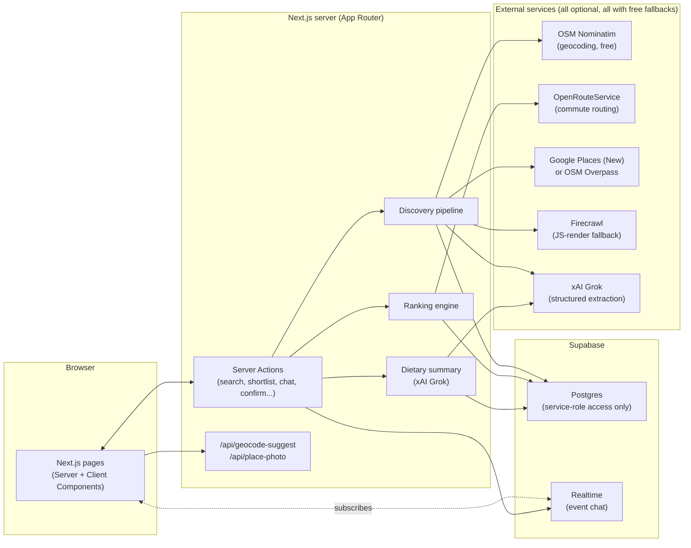
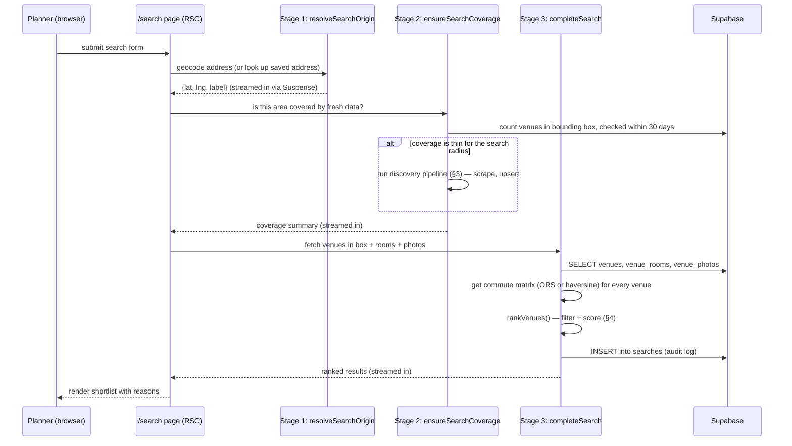
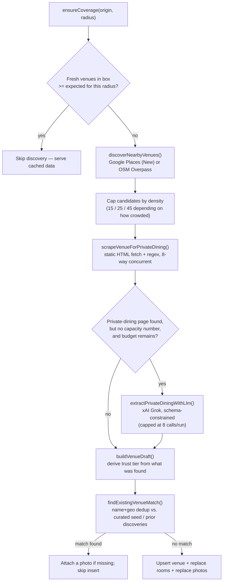
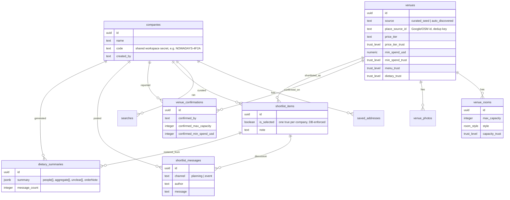
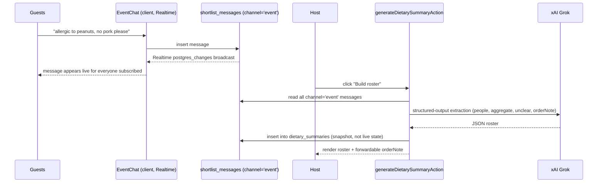

# Architecture

This document describes how Private Dining Finder is actually built: the request flow, the discovery pipeline, the trust/ranking model, the data model, and the event dietary-collection flow. The [`README.md`](./README.md) is the pitch; this is the blueprint.

## 1. System overview



**Key architectural decisions:**

- **All database access goes through the Supabase service-role key, server-side only.** There is no browser-side Supabase client for writes. The company-code "workspace" model (below) is enforced in the app layer, not via Supabase Auth + RLS-scoped `auth.uid()` — a deliberate trade-off for a zero-friction, no-signup research tool.
- **Every external paid API has a free, keyless fallback**, checked at the call site (`isXConfigured()` guards throughout `src/lib/discovery/` and `src/lib/dietary-summary.ts`) so the app runs completely with just a Supabase project.
- **Server Actions, not a REST API layer.** Mutations (`src/app/actions.ts`) are called directly from client components via `<form action={...}>` or `startTransition`, which is idiomatic for this Next.js version and avoids hand-rolling API routes for anything that isn't a genuine cross-origin or proxy concern (the two real `route.ts` files exist only because the browser needs a same-origin endpoint to hit: address autocomplete-as-you-type, and proxying Google Places photo bytes so the API key never reaches the client).

## 2. The search flow

A search has three sequential stages, deliberately split apart so the UI can show *what's actually happening* instead of a spinner (`src/lib/search-stages.ts`):



Each stage is a **shared promise, started eagerly and awaited inside separate `<Suspense>` boundaries** — React streams each boundary in as its promise resolves. This is not a client-side animated sequence: if the discovery pipeline is genuinely re-scraping a dozen sites, the "cross-referencing sources" message stays up because it's actually happening, not because a timer says so.

The candidate radius (`radiusForCommute` in `src/lib/search.ts`) is deliberately generous — sized off average speed for the mode plus a 1.6× safety factor — because it only decides which venues get a *real* commute calculation; the actual filter is the routed (or haversine-estimated) commute time against the planner's max.

## 3. The discovery pipeline

There is no API for "restaurant with a private room that seats 40," so discovery is a small multi-tier pipeline (`src/lib/discovery/`) gated behind a 30-day cache (`ensure-coverage.ts`):



Notes on specific tiers:

- **Discovery** (`places.ts`): Google Places `searchNearby` if `GOOGLE_PLACES_API_KEY` is set, else the free OpenStreetMap Overpass API. Neither is queried for "private dining" directly — that field doesn't exist in either API — so this step just finds *nearby venues in the right categories*ᐧ everything about private-dining specifically comes from the next steps.
- **Scrape** (`scraper.ts`): a static HTML fetch of the candidate's own website, pattern-matching for a private-dining/events page, capacity numbers, minimum spend, phone/email, and dietary-accommodation phrases. This is the free tier and runs for every candidate with a website.
- **Render** (`render.ts`, Firecrawl): only invoked when the static scrape found nothing — a real fallback for sites that render their private-dining content with JavaScript, not a default first pass. Optional, paid, and never run unless the free pass came back empty.
- **LLM extraction** (`llm-extract.ts`, xAI Grok): only invoked when a private-dining page was found but no capacity number could be pattern-matched — i.e., the page describes capacity in prose ("comfortably seats around fifty"). Capped at `MAX_ENRICHMENT_BUDGET = 8` calls per discovery run so a single dense search can't exhaust a credit balance; candidates are processed in discovery order, so budget goes to the closest venues first.
- **Trust derivation** (`trust.ts`): the single place that decides `verified` vs. `likely` vs. `ai_extracted` vs. `unverified`. When both the regex read and the LLM read produced a number, they're cross-referenced (`reconcileCapacity`): agreement within 20% *upgrades* confidence to `verified`; disagreement *downgrades* to `likely` and surfaces both figures rather than silently picking one.
- **Dedup** (`pipeline.ts::findExistingVenueMatch`): Google/OSM and the curated seed set share no identifier, so a normalized-name + 75m-radius match prevents the same physical restaurant from appearing as two cards.
- **No placeholder photos.** A venue with no confirmed photo shows an explicit "no photo found" state. An earlier version substituted a random stock photo so cards were never empty — that meant a planner could be looking at a picture of a *different* restaurant with total visual confidence. Honest absence beats a confident wrong image.

## 4. Trust tiers & ranking

Every capacity and price figure carries one of five tiers, ordered by strength of evidence:

| Tier | Weight | Evidence |
|---|---|---|
| `confirmed_by_planner` | 1.00 | A human phoned the venue; recorded in `venue_confirmations` |
| `verified` | 0.90 | Printed on the venue's own private-dining page (or two independent reads agree) |
| `likely` | 0.60 | Venue confirms private events but publishes no number (or two reads disagree) |
| `ai_extracted` | 0.45 | Read from the venue's own prose by an LLM, not matched verbatim |
| `unverified` | 0.30 | Nothing found — estimated from venue category as a last resort |

`rankVenues()` (`src/lib/ranking.ts`) is a hard filter followed by a weighted score:

1. **Filter**: drop venues with no commute result, commute over the planner's max, or no room that fits the headcount.
2. **Pick the best room**: the *smallest* room that still fits — a 50-person group in a 60-cap room reads as "the right size," the same group in a 1500-cap ballroom is technically fine but a worse fit.
3. **Score** = `0.35·commute + 0.30·capacityFit + 0.25·trust + 0.10·style`, where:
   - `commute` = `1 - minutes/max` (closer is better, floored at 0)
   - `capacityFit` = raw fit-tightness **multiplied by the capacity trust weight above** — this is the load-bearing part: a category-guessed capacity of ~60 for a party of 50 would otherwise score as an almost-perfect fit and beat a real, site-confirmed 200-seat room. A real load test against Times Square caught exactly this — a number the app invented outranked a number the venue published. Scaling fit by trust closes that hole structurally rather than patching the one case.
   - `trust` = `0.7·capacityTrust + 0.3·priceTrust`
   - `style` = 1.0 if style matches or wasn't requested, 0.4 if it was requested and doesn't match

Human-readable `reasons[]` are generated alongside the score (commute, room fit, trust-tier wording, style, price) — the planner sees *why* a result ranks where it does, not just a number.

## 5. Data model



Schema evolves via 10 sequential migrations in `supabase/migrations/`, applied in filename order:

| Migration | Adds |
|---|---|
| `0001_init` | Core schema: companies, addresses, searches, venues, rooms, photos, shortlist — plus RLS policies and grants |
| `0002_organizer` | `companies.created_by` |
| `0003_fix_place_source_unique` | Corrects the dedup unique index on `venues.place_source_id` |
| `0004_ai_extracted_trust` | Adds the `ai_extracted` trust tier to the enum |
| `0005_menu_dietary_trust` | Separate trust labels for `menu_url` and `dietary_notes` |
| `0006_planner_confirmations` | `confirmed_by_planner` tier (ranked above `verified`) + `venue_confirmations` table |
| `0007_shortlist_messages` | Live per-venue discussion thread + Realtime publication |
| `0008_shortlist_message_attachments` | Photo/video attachments on messages + `shortlist-media` storage bucket — built for a chat-based highlight-reel feature that was tried and removed; the columns remain but are no longer written to by any current UI |
| `0009_shortlist_highlight_reel_flag` | `is_highlight_reel` flag on messages, for the same removed feature — kept rather than dropped since removing a column is riskier than leaving an unused one |
| `0010_event_dietary_flow` | `shortlist_items.is_selected`, message `channel` (`planning`/`event`), `dietary_summaries` table |

**RLS model**: every table has row-level security *enabled*, with permissive `using (true)` policies. This isn't RLS doing access control — it's RLS deliberately configured (rather than left as an implicit deny) while the actual access control is "does the request carry a workspace's cookie/code," enforced in Server Actions that use the service-role key. A production version would replace the company-code cookie with real Supabase Auth and scope these same policies to `auth.uid()`.

## 6. Workspace model (no accounts)

`src/lib/workspace.ts` implements a "shared link" model instead of accounts: creating a workspace generates a human-typeable code (`SLUGIFIED-NAME-XXXX`) stored in `companies.code`; the browser gets an httpOnly cookie (`pdf_company_id`) pointing at that row. Anyone who is given the code and calls `joinCompanyWorkspace()` gets the same cookie and sees the same saved addresses, search history, and shortlist. There's a second cookie (`pdf_display_name`) purely for attributing chat messages and confirmations to a name, not an identity.

## 7. Event flow: from shortlist to dietary roster

Once a host selects a venue from the shortlist (`shortlist_items.is_selected`), the app opens `/event/[code]` — a page anyone with the workspace code can reach, with no further signup:



The extraction prompt is deliberately conservative for a safety-critical domain: nothing is inferred, an item is only labeled `allergy` if the attendee used that word, and every person's entry keeps their original wording verbatim so the host can audit the extraction against what was actually said. The summary is stored, not recomputed on every view — it's a snapshot the host can re-read and forward, and a new "N replies since this was generated" prompt tells them when to regenerate rather than the roster silently rewording itself.

**Client/server state note**: `EventThread` (`src/components/event-thread.tsx`) exists specifically to keep the "Build roster" button's enabled state in sync with the live Realtime message count — `EventChat` reports its current message list up via an `onMessagesChange` callback, rather than the button trusting a server-rendered count that goes stale the moment a new message streams in.

## 8. Directory map

```
src/
  app/                     routes (App Router)
    page.tsx               landing page (cached preview search)
    start/                 create/join a workspace
    search/                the 3-stage streamed search
    compare/               side-by-side venue comparison
    venue/[id]/             venue detail, rooms, confirmations
    shortlist/             the workspace's shortlisted venues
    event/[code]/           post-selection event chat + dietary roster
    summary/[code]/         read-only forward-to-decision-maker view
    api/                   the 2 browser-facing proxy routes
    actions.ts              all Server Actions (mutations)
  components/               client + server UI components
  lib/
    geo/                    geocoding, commute matrix, bounding boxes
    discovery/               the discovery pipeline (§3)
    supabase/                typed client/server Supabase factories + row types
    ranking.ts               scoring (§4)
    search.ts / search-stages.ts   the 3-stage search (§2)
    trust-labels.ts          single source of planner-facing trust wording
    workspace.ts             company-code workspace model (§6)
    dietary-summary.ts       event-chat -> roster extraction (§7)
    nl-query.ts              free-text search -> structured form
    price-signal.ts          price tier + cost-per-person derivation
    personas.ts              persona-aware form defaults
  data/seed-venues.ts        hand-curated fallback venues (permanent data floor)
supabase/migrations/         schema, in filename order (§5)
scripts/                     seed, scenario smoke test, live-service verification (no mocks)
```

## 9. Testing strategy

Two layers, deliberately different in what they can prove:

- **Unit tests (Vitest, `*.test.ts`)** — pure logic, no network: trust derivation, ranking math, price signals, scraper regex helpers, NL query parsing, personas. Fast, run in CI, prove the *rules* are right.
- **Verification scripts (`scripts/verify-*.ts`, `scripts/loadtest-*.ts`)** — hit real external services with real data and inspect real output. These exist because unit tests can't prove an external API still behaves as documented. Real defects were caught by these scripts, not the unit suite — most notably the ranking hole where a category-guessed capacity outranked a venue's own published figure, found by `scripts/loadtest-density.ts` against real Times Square data.
