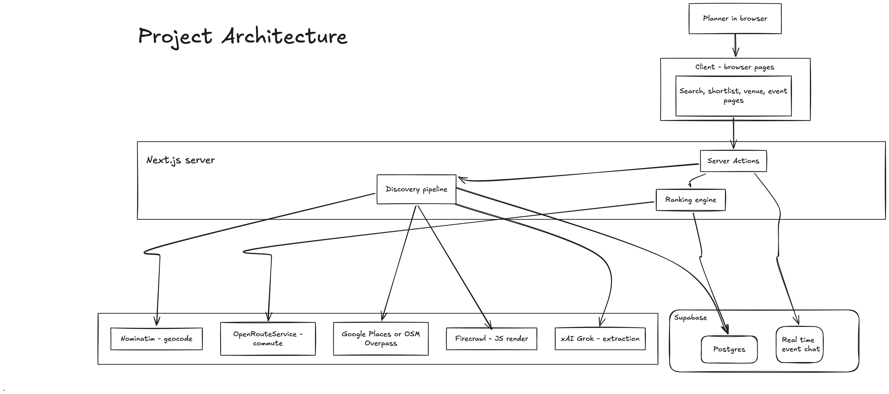
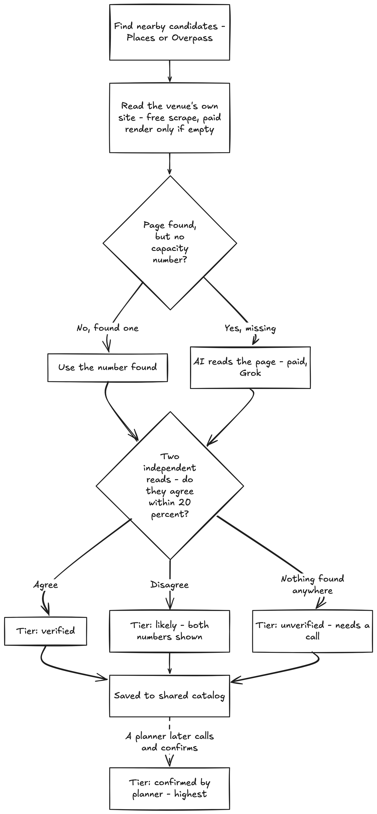

# Private Dining Finder

Find a private dining room that actually fits your group, with real evidence behind every number instead of a guess.

You give it an address, a headcount, and a max commute time. It gives you back a ranked list of private dining venues, and next to every capacity and price figure it tells you exactly how much you should trust that number.

📹 Demo video: [youtu.be/Fx1vd5Y7TZE](https://youtu.be/Fx1vd5Y7TZE)
📊 Pitch deck: [Google Slides](https://docs.google.com/presentation/d/1WdNsidrCnGDCRgebB9BCLryj4KqDXmhgPk-UHxAW6jg/edit?usp=sharing)

---

## The problem

Booking a private room for 30 to 200 people is a research project disguised as a search box. There's no API for "restaurant with a private room that seats fifty." The real answer lives scattered across a dozen open browser tabs: a venue's own events page, a three year old Yelp photo, a phone call nobody's made yet. Every planner ends up rebuilding the same spreadsheet from scratch, and the numbers in it carry wildly different reliability with no way to tell them apart.

The failure that actually hurts isn't picking the wrong restaurant. It's showing up with 60 people to a room nobody ever confirmed could hold more than 40.

## The solution

Instead of one search box, Private Dining Finder runs a small discovery and verification pipeline, and it never lets a guess look as trustworthy as a fact. Every capacity and price figure gets stamped with one of five trust tiers, and ranking is built so a confirmed number can't lose to a made up one just because the made up one happens to fit better.

- Search by address, headcount, commute time, mode, and room style. Or describe the event in plain English and let it fill the form in for you to check over.
- Ranking looks at real fit, not just proximity. Commute, capacity fit, evidence quality, and style all factor into one score, and a venue with no published number can't outrank one that has an actual figure.
- While a search runs you get a live readout of what's actually happening (sites fetched, results confirmed) instead of a spinner.
- Call a venue, get a real answer, confirm it in the app, and that figure flows straight into the shared catalog for the next person searching near there.
- Once you've compared and picked a venue, open a live event page where everyone attending tells you about allergies and dietary needs, and the host gets an AI-built roster ready to hand the kitchen.

This is a research and coordination tool, not a booking system. It never books, holds, or pays for anything. Calling the venue and placing the actual order are still on you.

## The trust tiers

This is really the whole idea, made visible everywhere a number shows up:

| Tier | What it means |
|---|---|
| `confirmed_by_planner` | Someone actually called the venue and reported the answer back into the shared catalog |
| `verified` | Printed on the venue's own private dining page |
| `likely` | The venue confirms private events but doesn't publish a number |
| `ai_extracted` | Read from the venue's own wording by an LLM, not matched word for word |
| `unverified` | Not confirmed anywhere. Needs a call |

Ranking actually uses these tiers, they're not just decoration. Capacity fit credit is scaled by the tier, so an estimated capacity can't outrank a published one just because the guess happens to land closer to the headcount.

## Architecture



Planners only ever touch the client pages at the top. Every action they take, running a search, adding to a shortlist, sending a chat message, goes through a Server Action, which is the single door into the backend. From there it splits into two engines: the discovery pipeline, which goes and finds real information about a venue instead of trusting a database that might be stale or empty, and the ranking engine, which decides which of the venues already on file are actually a good fit for this search.

The discovery pipeline itself is layered so the paid services only get used when the free ones come up empty. Nominatim turns an address into coordinates, Google Places or OpenStreetMap Overpass finds nearby venues, and then it reads the venue's own website. Only if that page can't be found or doesn't state a number does it escalate to Firecrawl (for pages that render with JavaScript) or xAI Grok (for a capacity written in prose instead of a clean figure). Commute time comes from OpenRouteService, called on the ranking side rather than during discovery, since it depends on the search itself rather than on the venue.

Here's how that escalation decides which trust tier a number actually gets:



Everything discovery finds gets written to Postgres, so the next search nearby reuses it instead of re-scraping. Realtime is the one part of the app that doesn't go through a request and response cycle at all. It's what pushes new chat messages to everyone on the event page as they're typed.

## Tech stack

| Layer | Choice |
|---|---|
| Framework | Next.js 16 (App Router, Server Components, Server Actions) + React 19 |
| UI | Tailwind CSS 4 + shadcn/ui |
| Database | Supabase (Postgres), accessed server side via the service role key |
| Realtime | Supabase Realtime (event chat) |
| Geocoding | OpenStreetMap Nominatim (free, keyless) |
| Commute routing | OpenRouteService Matrix API (free tier), haversine fallback |
| Venue discovery | Google Places API (New) (optional, paid) or OpenStreetMap Overpass (free fallback) |
| JS render fallback | Firecrawl (optional, paid, budget capped) |
| AI extraction / NL parsing | xAI Grok, structured outputs (optional, paid, budget capped) |
| Maps | Leaflet (2D) + MapLibre GL JS / OpenFreeMap (3D, keyless) |
| Tests | Vitest |

The app runs end to end with zero paid API keys. Every external call degrades to a free, clearly labeled fallback. See "Optional API keys" below.

## Getting started

### 1. Install dependencies

```bash
npm install
```

### 2. Create a Supabase project

Create a project at [supabase.com](https://supabase.com), then apply every migration in `supabase/migrations/` in filename order (`0001_init.sql` through `0010_event_dietary_flow.sql`). Either:

- Paste each file into the Supabase Studio SQL editor and run them in order, or
- Use the Supabase CLI: `npx supabase link --project-ref <your-project-ref>` then `npx supabase db push`

You can also run everything against a local Supabase instance instead. See "Local development" below.

### 3. Configure environment variables

```bash
cp .env.example .env.local
```

Fill in your Supabase project's URL, anon key, and service role key (under Project Settings, then API). Every other key is optional, see "Optional API keys" below. `.env*` files are gitignored; only `.env.example` is tracked.

### 4. Seed the fallback venues

```bash
npm run seed
```

Loads the curated venues (Carmine's, Dos Caminos, Perbacco, Hilton Hawaiian Village, and others) that guarantee the 3 required scenarios have real, verified data before the live pipeline ever runs.

### 5. Run it

```bash
npm run dev
```

Open [http://localhost:3000](http://localhost:3000), create a workspace, and search.

## Local development (no hosted Supabase project needed)

```bash
npx supabase init          # first time only
npx supabase start         # spins up Postgres + API locally via Docker, applies migrations
npm run seed                # seed against the local instance
npm run dev
```

`supabase start` prints a local API URL plus anon and service role keys. Copy those into `.env.local`. `npx supabase db reset` re-applies migrations from scratch.

## Optional API keys

| Variable | Without it | With it |
|---|---|---|
| `ORS_API_KEY` | Commute time is a haversine estimate, labeled "estimated" | Real walking/driving routes via [OpenRouteService](https://openrouteservice.org/dev/#/signup) (free tier) |
| `GOOGLE_PLACES_API_KEY` | Discovery uses the free OpenStreetMap Overpass API | Richer discovery and real venue photos via Google Places (New) |
| `FIRECRAWL_API_KEY` | Client rendered private dining pages come back `unverified` | Those pages get rendered and read instead of mislabeled from a tooling gap |
| `XAI_API_KEY` | Prose capacities aren't captured, and free text search is disabled | Adds the `ai_extracted` tier, cross source confidence checks, and NL query parsing |

Both paid tiers only run when the free path found nothing, and both are budget capped per search.

## Testing the 3 required scenarios

1. 50 people, Times Square, NYC, under 20 min: search `Times Square, New York, NY`
2. 30 people, Salesforce Tower, SF, under 15 min: search `415 Mission St, San Francisco, CA 94105`
3. 200 people, reception style, Hilton Hawaiian Village, Waikiki, under 15 min walk: search `Hilton Hawaiian Village, Honolulu, HI`, style set to "Reception / happy hour"

```bash
npm run test:scenarios   # runs all 3 scenarios directly against search/ranking, prints results
npm test                  # unit tests (Vitest): trust derivation, ranking, price signal, parsing, personas
```

Unit tests can't prove an external API still behaves as documented, so there are scripts that hit the real services directly. These make live network calls and cost API credits where a key is configured:

```bash
npx tsx scripts/verify-enrichment.ts
npx tsx scripts/verify-nl-query.ts
node --conditions=react-server --import tsx scripts/verify-flywheel.ts
node --conditions=react-server --import tsx scripts/verify-dietary-summary.ts
node --conditions=react-server --import tsx scripts/loadtest-density.ts
```

Two real defects (a ranking hole where a category guessed capacity outranked a venue's own published figure, and a stale prop bug in the dietary roster button) were caught by these scripts and by walking the flow directly, not by the unit suite.

## Known trade-offs

- Photos are partial. Auto-discovered venues pull real Google Places photos; a handful of curated seed venues show an honest "no photo found" instead of a stock placeholder, after one was tried and found more misleading than helpful.
- Capacity gets estimated when a venue publishes none, labeled `unverified` and named "Capacity unconfirmed." Kept because excluding unknown venues entirely would drop real candidates worth calling, and ranking no longer lets that guess outrank a published figure.
- No real authentication. A shared workspace code trades real auth for zero friction sharing, which is fine for a research tool with no sensitive data, but not for production as it stands.
- Confirmations are trusted on sight. Anyone with a workspace code can push a `confirmed_by_planner` figure into the shared catalog. Provenance is recorded, but there's no corroboration step yet.

## Project structure

```
src/lib/geo/               geocoding + commute time
src/lib/discovery/         live discovery, scraping, JS render + LLM tiers, trust labeling, caching
src/lib/ranking.ts         "best overall fit" scoring
src/lib/dietary-summary.ts AI-built dietary roster from the event chat thread
src/lib/workspace.ts       company-code workspace (create/join, cookie based)
src/app/                   routes (search, shortlist, compare, venue, event, summary)
src/data/                  curated fallback venue data
supabase/migrations/       database schema (apply in filename order)
scripts/                   seed, scenario smoke test, and live-service verification scripts
```

---

Built for Nowadays' "Private Dining Finder" take-home challenge.
